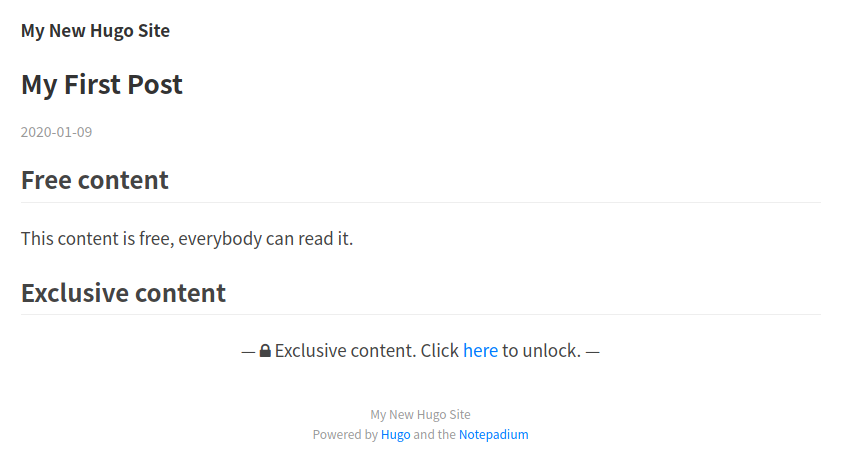
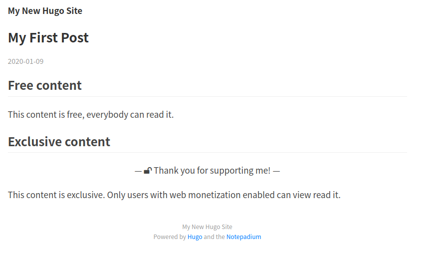
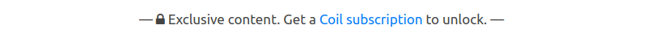
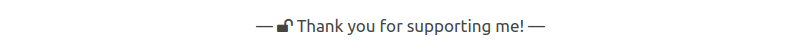
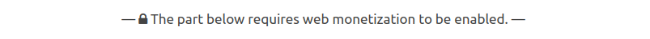
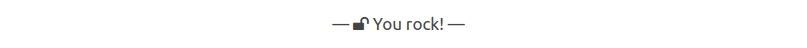

# Hugo Web Monetization Component

**Note: This is not a standalone theme but a theme component that enables web monetization on your entire hugo website.**

[Web monetization](https://webmonetization.org/) is a standard. It is a JavaScript browser API which allows the creation of a payment stream from the reader to the content creator using the [Interledger Protocol](https://interledger.org/). The user needs a browser extension like [Coil](https://coil.com/) or [Minute](https://github.com/interledgerjs/minute), or they are ahead of their time and use the [Puma Browser](https://www.pumabrowser.com/). These will check the website for the existence of a `meta` tag called "monetization" which includes the [payment pointer](https://paymentpointers.org/). You, the content and website creator, need such a a payment pointer.

This component adds a partial including the "monetization" `meta` tag and the payment pointer of the creator.

## How to add the component to your site

Add the component as second theme to your hugo site:
```
git submodule add git@github.com:sabinebertram/hugo-webmonetization-component.git themes/webmonetization
```

## How to configure and enable web monetization

In your `config.toml`, add the component to `theme`:
```toml
theme = ["YOUR-MAIN-THEME", "webmonetization"]
```

Additionally, add your [payment pointer](https://paymentpointers.org/) in the `params` section of your `config.toml`:
```toml
[params]
  monetization = "$twitter.xrptipbot.com/sabinebertram_"
```

The last part is a bit more tricky. You need to add the partial to the `head` of your website. Because you don't want to mess with the actual theme, you need to create a file that overwrites the file that is defining the `head`, usually a file called `baseof.html` or a partial called `head.html`. Depending on how your main theme is set up, the location may be different. Here are two possibilities:

1. There is a partial called `head.html`, usually in `themes/<YOUR-MAIN-THEME>/layouts/partials/` or `themes/<YOUR-MAIN-THEME>/layouts/partials/head/`:

    a) Create a file in `layouts/partials/` called `head.html` and copy the contents from `themes/<YOUR-MAIN-THEME>/layouts/partials/head.html` or `themes/<YOUR-MAIN-THEME>/layouts/partials/head/head.html`.

    b) Include the web monetization partial in the bottom of this new `head.html`:
    ```html
    {{ partial "webmonetization.html" .}}
    ```

2. The `head` is defined in `themes/<YOUR-MAIN-THEME>/layouts/_default/baseof.html`:

    a) Create a file in `layouts/` called `baseof.html` and copy the contents from `themes/<YOUR-MAIN-THEME>/layouts/_default/baseof.html`

    b) Include the partial within the `head` tag:
    ```html
    <head>

      <!-- whatever else is there  -->

      {{ partial "webmonetization.html" .}}
    </head>
    ```

## How to have different payment pointers for different pages
In some cases you may want to have a different payment pointer for each page, e.g. when you are writing a blog together with other people. You can define a different payment pointer, different from the one defined in the `config.toml`, in every markdown file by adding it to the markdown head.
```md
---
title: "My First Post"
date: 2020-01-09T21:45:39+01:00
draft: true
monetization: "$twitter.xrptipbot.com/WietseWind"
---
```
Now, every individual blogger gets credit for their content. Moreover, you may even omit the payment pointer in the `config.toml` to only have individual blog posts web monetized. 

## How to create exclusive content

If you want to hide parts of your website that should only be visible to users that have web monetization enabled, you can do so by enframing this part with the `{}` and `{}` tags. For example
```markdown
## Free content

This content is free, everybody can read it.

## Exclusive content

{}

This content is exclusive. Only users with web monetization enabled can view read it.

{}
```

Additionally, you have to set your markdown renderer in your `config.toml` to `blackfriday`:
```toml
[markup]
  defaultMarkdownHandler = "blackfriday"
```

This is how locked content is displayed:
<kbd></kbd>

This is how unlocked exclusive content is displayed:
<kbd></kbd>

**Note that the exclusive content is only hidden to the non-tech-savvy users.** Those that know how to access the DOM will find it. This is due to the fact that Hugo is a static website generator and content is not stored on some server. 

## How to add custom messages to exclusive content

The standard messages are 
<kbd></kbd>
and
<kbd></kbd>

You can add custom messages by setting the parameters `exclusiveThanks` and `exclusiveError` in the `params` section of your `config.toml`:
```toml
[params]
  monetization = "$twitter.xrptipbot.com/sabinebertram_"
  exclusiveError = "The part below requires web monetization to be enabled."
  exclusiveThanks = "You rock!"
```
Now, the messages are the following:
<kbd></kbd>
and
<kbd></kbd>

## TODO:
- [x] Multiple payment pointers
- [x] Exclusive content
- [x] Custom message for exclusive content
- [ ] Possibility to add a banner that shows that the page is web monetized.